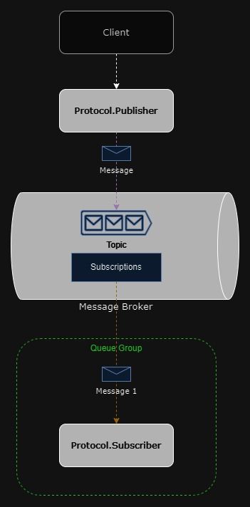

#  Componente de recepção de protocolos para emissão de documentos

Este projeto consiste na construção de um componente para recepção e processamento de protocolos de emissão de documentos, com base na solicitação de vias de um RG. A solução é composta por três principais funcionalidades:

- Envio de Protocolos (Publisher): Um componente responsável por enviar os protocolos (dados fictícios) para uma fila no RabbitMQ, utilizando mensagens no formato JSON.

- Processamento de Protocolos (Consumer): Um consumidor que recebe as mensagens da fila, valida os dados, armazena os protocolos na base de dados, e gera logs em caso de dados inválidos.

- API de Consulta: Uma API que permite a consulta de protocolos armazenados com base no número do protocolo, CPF ou RG, garantindo que a aplicação esteja protegida por um mecanismo de autenticação.



## Documentação da API

#### Retorna todos os xpto

```http
  GET /api/xpto
```

| Parâmetro   | Tipo       | Descrição                           |
| :---------- | :--------- | :---------------------------------- |
| `api_key` | `string` | **Obrigatório**. A chave da sua API |

#### Retorna um xpto

```http
  GET /api/xpto/${id}
```

| Parâmetro   | Tipo       | Descrição                                   |
| :---------- | :--------- | :------------------------------------------ |
| `id`      | `string` | **Obrigatório**. xpto |